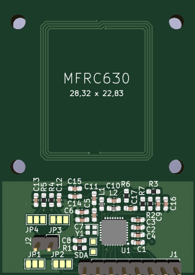
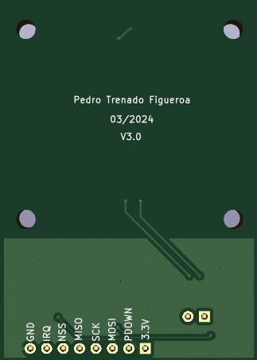

# Sistema Electrónico para la Actualización Firmware de Sensores vía NFC

Este proyecto tiene como objetivo el diseño e implementación de un sistema electrónico para la actualización del firmware de sensores a través de la tecnología NFC (Near Field Communication).

## Descripción del Proyecto
Ante la necesidad de mejorar el proceso de actualización de dispositivos de bajo consumo alimentados por baterías, se ha determinado que la mejor forma de llevar a cabo esta tarea es mediante NFC. Este sistema permitirá actualizar los sensores de manera eficiente y sin la necesidad de acceder físicamente a la PCB.

## Diseño de las PCB
Las placas de circuito impreso (PCB) han sido diseñadas utilizando la herramienta KiCad 7.

### Ejemplo de diseño
A continuación se muestra un ejemplo del diseño frontal y posterior de la PCB cuya antena NFC es del tamaño de la antena del sensor:

     
    

